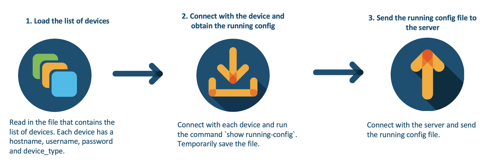
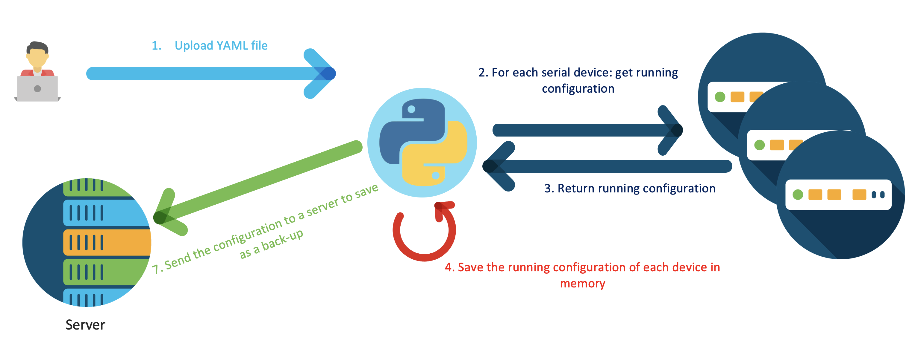

Backup Config Script
=====================================
For many users and service providers, it is important to make regular back-ups of your configuration files, so you can easily revert back to a working state. Cisco IOS-XE is an open and flexible operating system. In this Proof of Value (PoV), we take a three step approach to back-up our running configs and send the back-up to a server:

1. First, we read in a list of devices, which is a yaml file. In the list of devices, each device has a `hostname`, `username`, `password` and `device_type`. In this repository, we have uploaded a few Always-On DevNet Sandboxes. 

> For more information on the DevNet Sandboxes, click [here](https://devnetsandbox.cisco.com)

2. Next, we loop through the list of devices and for each device, we make a connection and we run the command `show running-config` to obtain the running coniguration. After obtaining the running configuration, we save it temporarily. 

3. Last, we send the running configuration to a server using an `scp` command. We repeat the process for each device in the list of devices. 

## Contacts
* Simon Fang (sifang@cisco.com)

## Contacts
* Simon Fang (sifang@cisco.com)
* Stien Vanderhallen (stienvan@cisco.com)

## White Paper
Provide links to related white papers:

* [Cisco IOS XE Datasheet](https://www.cisco.com/c/en/us/products/ios-nx-os-software/ios-xe/index.html#)
* [Cisco IOS XE: Secure, Open, and Flexible At-a-Glance](https://www.cisco.com/c/en/us/products/collateral/ios-nx-os-software/ios-xe/nb-09-ios-xe-secure-open-flex-aag-cte-en.html)

## Related Sandbox
Provide a link to a related DevNet Sandbox:

* [IOS XE on Catalyst 9000 17.03 Code](https://devnetsandbox.cisco.com/RM/Diagram/Index/98d5a0fb-1b92-4b5b-abf6-a91e0ddba241?diagramType=Topology)
* [IOS XE on CSR Latest Code](https://devnetsandbox.cisco.com/RM/Diagram/Index/a5823504-3391-47cc-93a4-8bcadc701839?diagramType=Topology)
* [IOS XE on CSR LAtest Code with ZTP](https://devnetsandbox.cisco.com/RM/Diagram/Index/f2e2c0ad-844f-4a73-8085-00b5b28347a1?diagramType=Topology)
* [IOS XE on CSR Recommended Code](https://devnetsandbox.cisco.com/RM/Diagram/Index/cae403c2-27af-4c7d-b1e1-99b7d42f1504?diagramType=Topology)
* [IOS XE on CSR recommended Code AlwaysOn](https://devnetsandbox.cisco.com/RM/Diagram/Index/27d9747a-db48-4565-8d44-df318fce37ad?diagramType=Topology)

## Links to DevNet Learning Labs
Provide links to related Learning Labs or modules on DevNet:

* [Enabling Telemetry on IOS XE](https://developer.cisco.com/learning/labs/enabling_telemetry_on_iosxe/)

