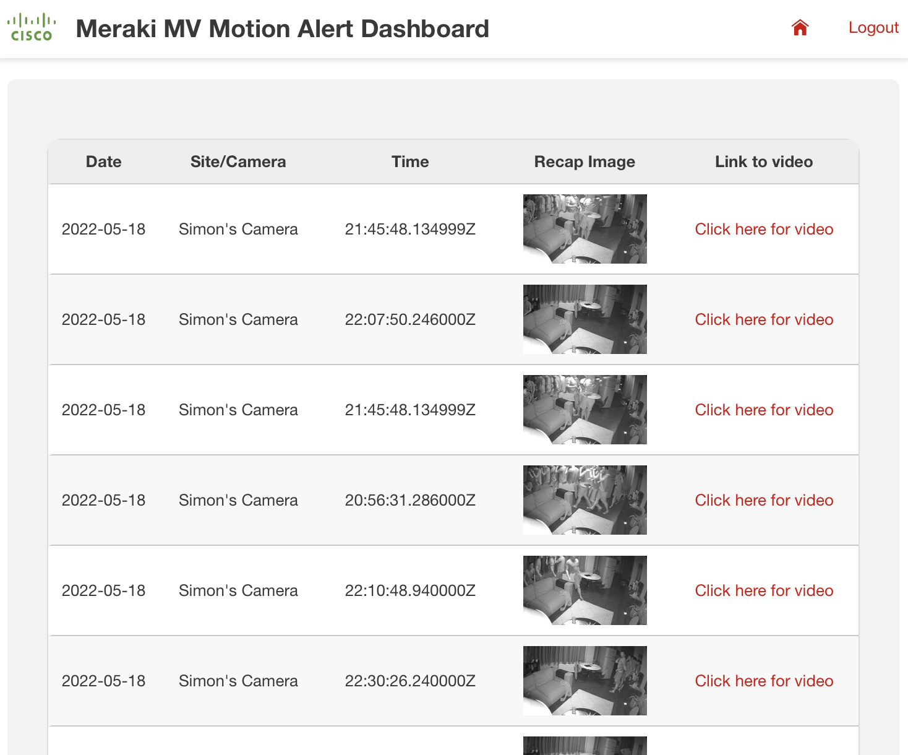
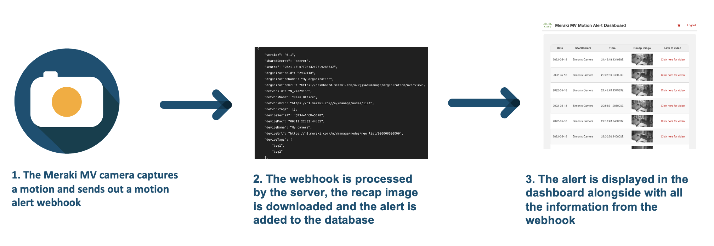
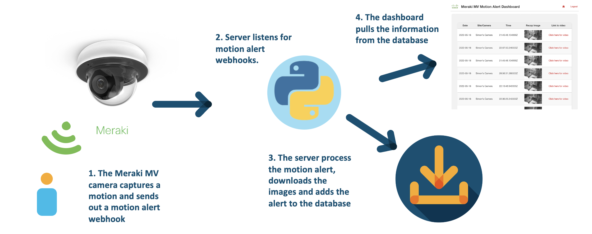

Meraki MV Motion Alert Dashboard
=====================================
The Meraki MV cameras are cloud-managed, smart cameras with rich API functionality. One of these functionalities is to enable motion alerts on the cameras through the Meraki dashboard. While all the information and data can be accessed through the Meraki dashboard, some customers would like to embed the motion alert information in their own applications. The motion alerts are delivered through email and webhooks. In this prototype, we leverage the information from the motion alert webhook and we create a custom dashboard using the information provided in the webhook. 

The dashboard captures the date, time, location/name of the camera, a recap image and a link to the footage accessible through the Meraki dashboard. The recap image is a composite image of the motion and the link is provided with a timestamp, which will allow us to start the video at the start of the motion. For an example of the dashboard, see the image below. 

The prototype is developed using the Flask framework. In the back-end, we have a dedicated webhook listener and once a webhook comes in, we process the information, download the recap image and add the alert to the database. 

## White Paper
Provide links to related white papers:

* [Meraki MV datasheet](https://meraki.cisco.com/wp-content/uploads/2020/05/meraki_datasheet_mv_family.pdf)

## Related Sandbox
Provide a link to a related DevNet Sandbox:

* [Meraki Always On](https://devnetsandbox.cisco.com/RM/Diagram/Index/a9487767-deef-4855-b3e3-880e7f39eadc?diagramType=Topology)

## Links to DevNet Learning Labs
Provide links to related Learning Labs or modules on DevNet:

* [Meraki MV Sense](https://developer.cisco.com/learning/lab/meraki-08-mv-sense/step/1)

## Solutions on Ecosystem Exchange
Provide links to related solutions on DevNet Ecosystem Exchange:

* [Splash MV Retail Fashion Tags](https://developer.cisco.com/ecosystem/meraki/apps/60f02b2ed805d2200f31985f/)
* [Splash MV ALPR Alerts](https://developer.cisco.com/ecosystem/meraki/apps/60f02b2ed805d2200f31985f/)
