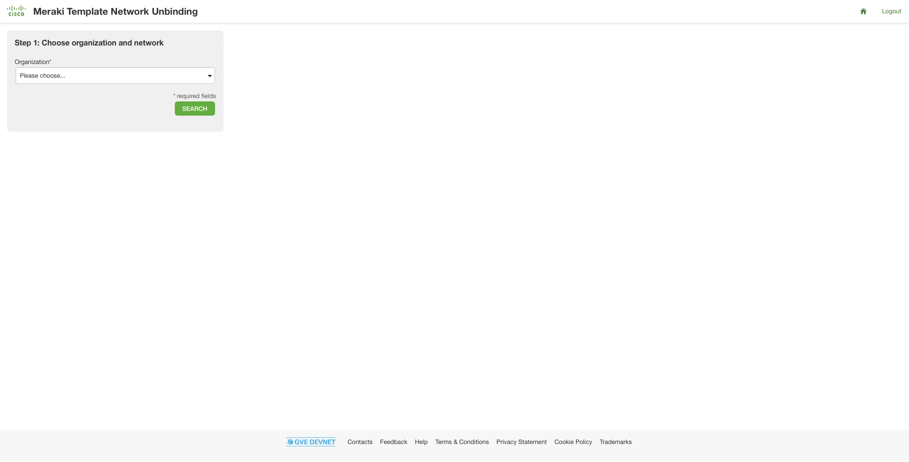
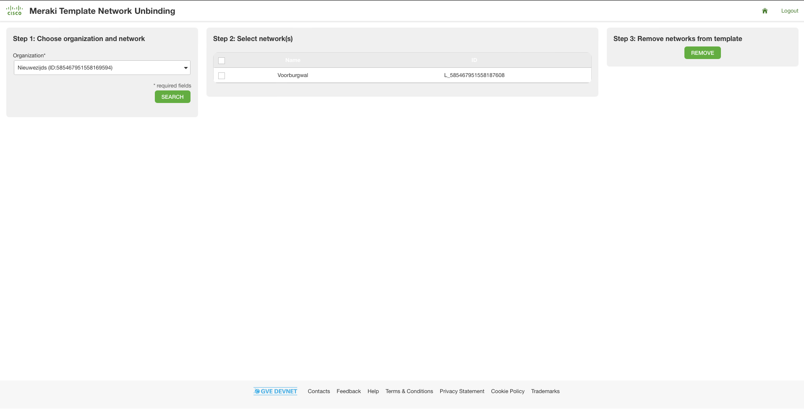
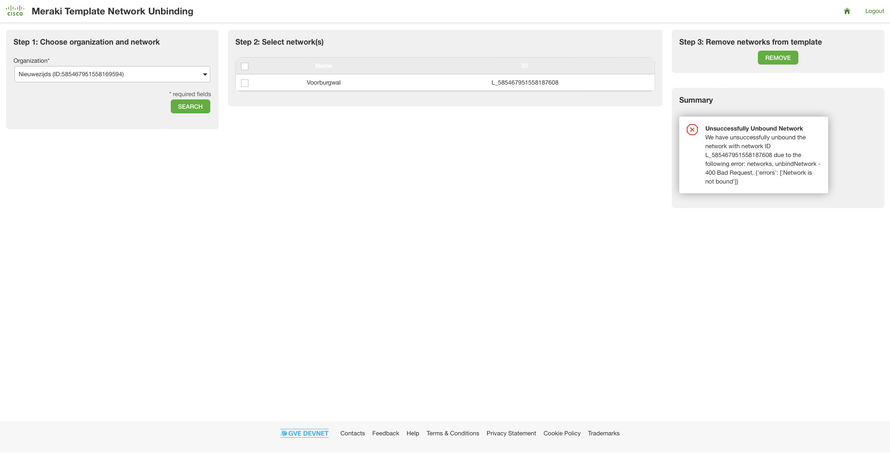

# Meraki Template Network Unbinding App
Unbinding the network from a template for a large number of networks can take a long time and is error-prone. This prototype shows you how to programmatically unbind a large number of networks from a template. You can accomplish it in three steps: 

1. Select the organization

2. Select the networks

3. Unbind the networks from the template

## Contacts
* Simon Fang (sifang@cisco.com)
* Stien Vanderhallen (stienvan@cisco.com)

## White Paper
Provide links to related white papers:

* [Meraki Cloud Management datasheet](https://meraki.cisco.com/lib/pdf/meraki_datasheet_cloud_management.pdf)

## Related Sandbox
Provide a link to a related DevNet Sandbox:

* [Meraki Always On](https://devnetsandbox.cisco.com/RM/Diagram/Index/a9487767-deef-4855-b3e3-880e7f39eadc?diagramType=Topology)

## Links to DevNet Learning Labs
Provide links to related Learning Labs or modules on DevNet:

* [Meraki MV Sense](https://developer.cisco.com/learning/lab/meraki-08-mv-sense/step/1)
* [Meraki Dashboard API Mission](https://developer.cisco.com/learning/labs/dne-meraki-mission-1/)
