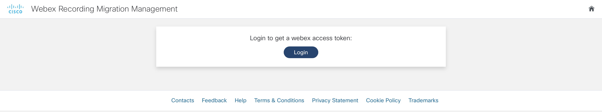
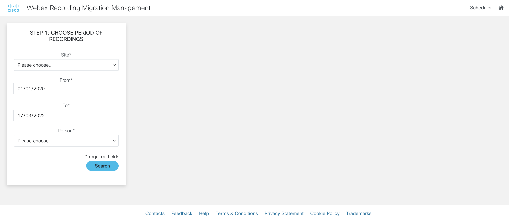
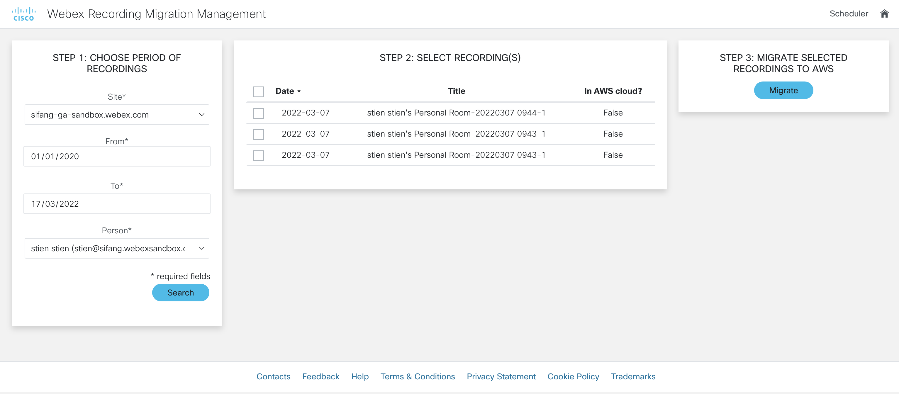
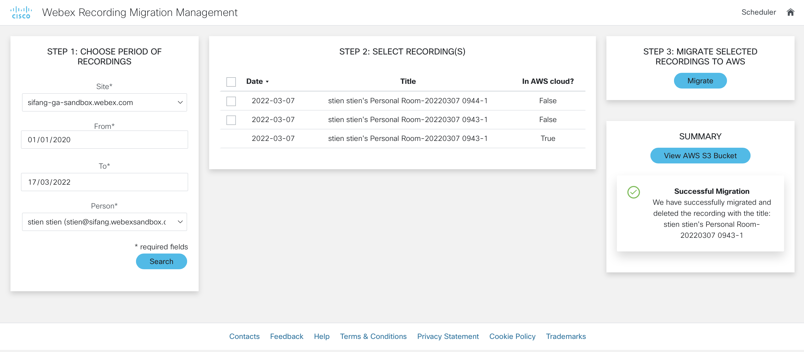
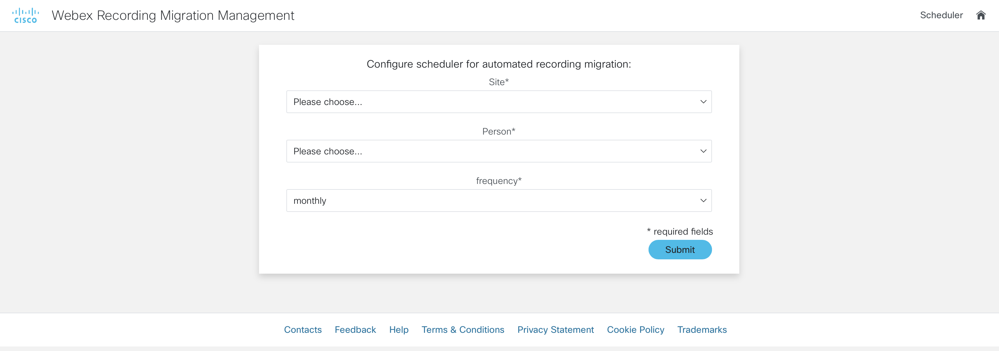

# GVE DevNet Webex Recording Migration Management
Please note: this repository is an adaptation of the [Webex Recordings to AWS App](https://github.com/gve-sw/gve_devnet_webex_recordings_to_aws). We have extended the code for the admin user, so the admin user can migrate all the recordings to a cloud storage solution and delete the recordings from the Webex cloud. 

Cisco Webex is THE unified app for the future of work, where you can call, meet, collaborate and message. Webex allows you to record meetings if needed and the Webex cloud stores recordings by default up to one year and with a maximum of 10 years. However, some customers are required by law to store recordings for a longer period of time. One solution would be to migrate the recordings to the AWS cloud. 

By using the Webex and AWS API, we have created a Flask application that integrates the two solutions and allows the user to migrate recordings from the Webex cloud to the AWS cloud. We can migrate the recordings in a few simple steps:

0. First, we have to login and obtain our Webex access token:

1. After having logged in and authorized the application, we should select the `siteUrl`, the `period` and the `hostEmail` that we are interested in:

2. Then, we will obtain a table of all the recordings that are available and it will be immediately indicated if the Webex recording has been migrated to the cloud or not: 

3. When you have selected the recordings that you would like to migrate, you can press the button `Migrate` to start the migration process and afterwards you will get a summary of the recordings that have migrated:

4. The process above is mainly manual, but in some use cases, we would like to automate the whole flow. In that case, we can create a scheduler that will migrate all the recordings in a certain period based on a daily, weekly, biweekly or monthly frequency:

Please note: the scheduler's back-end has not been fully implemented. The front-end serves as a mock-up and inspiration on how to do an automated flow of this use case. 

## White Paper
Provide links to related white papers:
* [5 reasons more companies choose Webex meetings](https://www.cisco.com/c/dam/m/digital/elq-cmcglobal/OCA/Assets/Collaboration/5-reasons-more-companies-choose-webex.pdf)
* [Cisco Webex Meetings Security White Paper](https://www.cisco.com/c/en/us/products/collateral/conferencing/webex-meeting-center/white-paper-c11-737588.html)

## Related Sandbox
Provide a link to a related DevNet Sandbox:

* [Cisco Webex Sandbox](https://devnetsandbox.cisco.com/RM/Diagram/Index/cf7eca30-b4e8-44be-a529-e25a1c078ab3?diagramType=Topology)

## Links to DevNet Learning Labs
Provide links to related Learning Labs or modules on DevNet:

* [Webex Meetings APIs](https://developer.cisco.com/learning/labs/collab-webex/)
* [Configure a Webex integration](https://developer.cisco.com/learning/labs/collab-business-conf-webex-integration-itp/)
* [Calling Webex REST APIs from Python](https://developer.cisco.com/learning/labs/webex-messaging-python/)
* [Using Postman with the Webex REST API](https://developer.cisco.com/learning/labs/webex-messaging-postman/)
* [Generating Pythong Webex API code using Postman](https://developer.cisco.com/learning/labs/collab-webex-interfacing-with-rest/)

## Solutions on Ecosystem Exchange
Provide links to related solutions on DevNet Ecosystem Exchange:

* [Amazon Web Services](https://developer.cisco.com/ecosystem/security/partners/security_amazonwebservices/)

