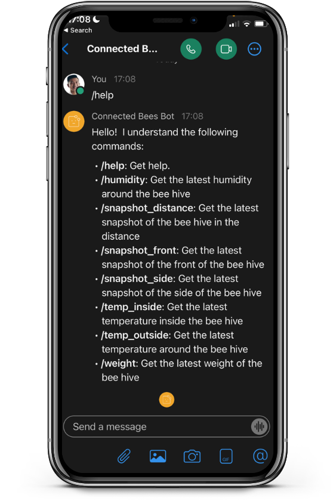

Meraki Alert Webex Bot Notification
=====================================
Meraki has a broad portfolio including routers, switches, APs, cameras and sensors. The Meraki cloud is the backbone of the highly available, secure, and efficient Meraki solution. It allows for easy management and provisioning of the devices. Moreover, all the products and solutions are programmable, which allows us to build customization and integrations. In this Proof of Value (PoV), we have created an integration between the Meraki sensors, cameras and Webex. Once a Meraki MT sensor is triggered, an alert is sent to a Webex space along with a link to the video wall, which allows all the members of the Webex space to view the cameras an remotely observe the site after a sensor is triggered. 

Remote observance is especially useful for offices, for example, and remote observance is in demand due to the fact that we are transitioning towards a hybrid work experience. Moreover, in our use case, there is a bee hive located at the office. For safety reasons, bee hive inspections have to be done with two or more people. In the unlikely event of an accident, the second person can provide assistance or call the emergency services. However, since fewer people are attending the office, it is sometimes inconvenient to have two people doing the inspection. Therefore, we have created a process and integation that allows us to conduct remote observance, where one team member can do the bee hive inspection alone, while team members observe the site remotely and can contact assistance if needed. 

In addition to remote observance, the team would also like to monitor the honey bee colony. For this PoV, we have installed three Meraki MV cameras and a BEEP base, which encompasses multiple sensors to monitor a bee hive colony. We have created a bot that would interact during the remote observance process, but we have added features that allows the users to generate snapshots from the Meraki cameras or query the latest metric, e.g. temperature, humidity, weight, etc. 

In summary, the bot has the following functionalities:

* Remote observance system that starts after a Meraki MT door sensor is opened
* Generate snapshots from the Meraki MV cameras
* Query the latest metrics from the beep base, e.g. temperature, humidity, weight, etc.

## White Paper
Provide links to related white papers:
* [Cloud-Managed Smart Cameras: Meraki MV](https://meraki.cisco.com/product-collateral/mv-architecture-overview/?file)

## Related Sandbox
Provide a link to a related DevNet Sandbox:

* [Meraki Always On](https://devnetsandbox.cisco.com/RM/Diagram/Index/a9487767-deef-4855-b3e3-880e7f39eadc?diagramType=Topology)

## Links to DevNet Learning Labs
Provide links to related Learning Labs or modules on DevNet:

* [Meraki MV Sense](https://developer.cisco.com/learning/lab/meraki-08-mv-sense/step/1)

## Solutions on Ecosystem Exchange
Provide links to related solutions on DevNet Ecosystem Exchange:

* [Splash MV Retail Fashion Tags](https://developer.cisco.com/ecosystem/meraki/apps/60f02b2ed805d2200f31985f/)
* [Splash MV ALPR Alerts](https://developer.cisco.com/ecosystem/meraki/apps/60f02b2ed805d2200f31985f/)

